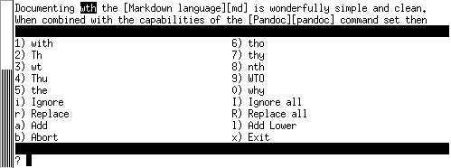

<!-- -->
# Creating a Pandoc workspace

An installation of Pandoc along with the requisite latex support files 
is needed.  In this document I install Pandoc on Ubuntu LTS 22.04.  Other
Linux distributions will have differing package name and differing package
dependencies.

## Installing the packages

### Pandoc

```console
// Let's see what would be installed, without actually installing it:
$ sudo apt install pandoc
The following additional packages will be installed:
  libcmark-gfm-extensions0.29.0.gfm.3 libcmark-gfm0.29.0.gfm.3 pandoc-data
Suggested packages:
  texlive-latex-recommended texlive-xetex texlive-luatex pandoc-citeproc
  texlive-latex-extra context wkhtmltopdf librsvg2-bin groff ghc nodejs
  php python ruby r-base-core libjs-katex citation-style-language-styles
 ...
Do you want to continue? [Y/n] n
Abort.
```

I have installed pandoc a few times now, and I know how important some
of the suggested packages are.  Since we will be generating PDF formats
then TeX and its various flavours and support files will also be needed.

```console
// So I install the suggested packages ... over 100 packages will be pulled in:
$ sudo apt install texlive-latex-recommended texlive-xetex texlive-luatex \
 pandoc-citeproc texlive-latex-extra context texlive-fonts-recommended wkhtmltopdf
...
The following NEW packages will be installed:
  context context-modules dvisvgm feynmf fonts-gfs-artemisia
  fonts-gfs-baskerville fonts-gfs-bodoni-classic fonts-gfs-didot
  fonts-gfs-didot-classic fonts-gfs-gazis fonts-gfs-neohellenic fonts-gfs-olga
  ...
  tex-gyre texlive-base texlive-binaries texlive-extra-utils
  texlive-font-utils texlive-fonts-recommended texlive-latex-base
  texlive-latex-extra texlive-latex-recommended texlive-luatex
  texlive-metapost texlive-pictures texlive-plain-generic texlive-xetex tipa
  tk tk8.6 wkhtmltopdf
 ...
Running updmap-sys. This may take some time... done.
Running mktexlsr /var/lib/texmf ... done.
Building format(s) --all.
        This may take some time... done.
Running mktexlsr /var/lib/texmf ... done.
Building format(s) --all.
        This may take some time... done.
```

Now we install pandoc, which pulls in 'pandoc-data'

```console
$ sudo apt install pandoc
 ...
The following additional packages will be installed:
  pandoc-data
 ...
```

### Editors

My editor of choice is *gvim* -- that is -- *graphical vim*.  You will need
to use a decent editor.  It would be painful I think to write Markdown
documentation with a minimalist text editor (like [*nano*][nano] or [*le*][le]).

Perhaps you already have a favourite editor on the Linux platform.  Some
other text editors in my version of Ubuntu LTS are:

   * pluma (`$ sudo apt install pluma`{.console})
   * gedit (if not installed then: `$ sudo apt install gedit`{.console})
   * kate (`$ sudo apt install kate`{.console})
   * emacs (`$ sudo apt install emacs-gtk`{.console})

I provide help syntax highlighting the *console input/output fenced code*
with both 'vim/gvim' and 'kate'.  If you are not documenting console
input/output then it will not matter which editor you use.  There are after
all more than 130 computer 'languages' which Pandoc's Markdown is able to
highlight.

```console
// To install graphical vim:
$ sudo apt install vim-gtk3
```

[nano]: https://help.ubuntu.com/community/Nano
[le]: https://manpages.ubuntu.com/manpages/impish/man1/le.1.html

### PDF viewers

I like the *evince* PDF viewer on my Ubuntu desktop.  The 'table of contents'
outline shows up in the left pane on 'evince', and you can toggle
it on/off by clicking the 'Side pane' icon in the upper left.

Another PDF viewer is *qpdfview*.  In order to see the 'outline', select:

   View -> Docks -> Outline

```console
// Install the PDF viewers:
$ apt install evince qpdfview
```

An excellent, but non-free PDF viewer is [Master PDF Editor][masterpdfeditor].  

> *The unregistered version can be used only in personal, noncommercial
purposes to view documents, fill PDF forms, comment and print
documents. In order to use the application for commercial purposes,
and with its full functionality you are required to purchase a license.*

For Ubuntu, Debian and OpenSuse / Red Hat / CentOS you can
[download a free version][getmasterpdf].  If you are interested
in using it for more complex reasons like form-filling, PDF document editing
and digital signing, then buy a license.

For x86/x86_64 architectures there are software packages available. 
However the version of Master PDF Editor for the *arm64* architecture must be 
installed from the supplied [tarball][tgz]:

Here is an example of installing it on Ubuntu LTS on a Raspberry Pi:

```console
$ mkdir ~/temp/
$ cd ~/temp/
$ tar zxf /path/to/master-pdf-editor-5.9.50-qt5.arm64.tar.gz
$ ls -CpF
master-pdf-editor-5/
$ mkdir -p ~/bin/mpdf
$ cp -a master-pdf-editor-5/ ~/bin/mpdf/
// Remove the temporary installation directory
$ rm -rf ~/temp

// A few extra libraries are needed to run this program:
$ sudo apt install libqt5xml5 libqt5concurrent5 

$ cd ~/bin/mpdf/
$ ls -CpF
fonts/  license_en.txt     masterpdfeditor5.desktop  stamps/
lang/   masterpdfeditor5*  masterpdfeditor5.png      templates
$ file masterpdfeditor5
masterpdfeditor5: ELF 64-bit LSB executable, ARM aarch64,
version 1 (GNU/Linux), dynamically linked, interpreter
/lib/ld-linux-aarch64.so.1, for GNU/Linux 3.7.0,
BuildID[sha1]=94ca9680e3f0ae39e622aa4e2ab9cbc9c189e63e, stripped

$ cd
$ ~/bin/mpdf/masterpdfeditor5 -h

Master PDF Editor 5
Build 5.9.50, arm 64 bit
 ...
```

[masterpdfeditor]: https://code-industry.net/masterpdfeditor/
[getmasterpdf]: https://code-industry.net/free-pdf-editor/#get
[tgz]: https://en.wikipedia.org/wiki/Tar_(computing)

### Spell checking software

The larger the document, the more likely it is that you will appreciate some
form of spell checking.

#### Spell checking in editors

A good editor will offer spell checking as an option; it is typically found
in a *Tools* menu of your favourite editor.  If you decide that your
editor's spell checking is useful then proceed with it.  Embedded spell
checking is available on gvim, pluma, emacs, kate and gedit.  It is even
better to have spell checking which is *markdown-aware*; by that I mean
it does not try to spell check inside Markdown syntax and elements.  You
will need to experiment with your editor's spell checking.

#### Spell checking with native programs

Two widely used open source spell checkers are [*aspell*][aspell] and
[*hunspell*][hunspell].  Both programs have dictionaries in dozens of languages:

```console
$ apt list | egrep '^aspell-' | wc -l
69

$ apt list | egrep '^hunspell-' | grep -v tools | wc -l
75
```

For markdown-based documentation 'aspell' has a markdown-aware option. I 
gave it a try and at least for me I found it somewhat useful.
Here I invoke 'aspell' using the *Markdown* mode on a file named *overview.md*:

```console
$  aspell check --dont-backup --mode=markdown overview.md
```

Its spell checking is fairly easy to navigate -- the image below
shows a terminal session with 'aspell':

{#id .class width=60%}

#### Spell checking with the Lua filter

Another option is to use the [Lua][lua] filtering capability of Pandoc.
It is primitive, but it has a few useful options:

   * you can quickly generate a list of technical words that you can
     ask *aspell* to ignore
   * by eliminating technical words you can quickly find the odd spelling
     mistake even though it is simply a list of possibly misspelled words.

Software packages for these filters do not exist (or at least I did not
find them), so you would need to pull them from github:

```console
// get the files
$ mkdir ~/git
$ cd ~/git
$ git clone --depth=1 'https://github.com/pandoc/lua-filters'
$ cd lua-filters
```

You can install only the spell checking file, or you can install all of 
the filters:

```console
// The filters need to be installed in your pandoc configuration directory:
$ mkdir -p ~/.pandoc/filters

// copy only the spelling filter to your work area
$ cp -up spellcheck/spellcheck.lua  ~/pandoc/filters/

// or copy all the filters to your work area using 'find' and looping over them:
$ find . -type f -a  -name \*.lua | \
  while read f ; do \
    echo $f; \
    cp -up $f ~/.pandoc/filters/; \
  done
$ ls -l ~/.pandoc/filters/*spell*
/home/myname/.pandoc/filters/spellcheck.lua
```

Invoke the filter and get a list of possibly misspelled words.  You can
add them to [your personal dictionary][aspell-pws]:

```console
// As an example, use the filter on 'overview.md'
$ pandoc --lua-filter spellcheck.lua overview.md 
docx
wth

// So I add docx to my personal dictionary (and fix the spelling of 'with'):
$ nano ~/.aspell.en.pws
$ head ~/.aspell.en.pws 
personal_ws-1.1 en 37
backticks
CentOS
css
dev
docx
fsck
 ...
```

[aspell]: https://en.wikipedia.org/wiki/GNU_Aspell
[hunspell]: https://en.wikipedia.org/wiki/Hunspell
[lua]: https://www.lua.org/about.html
[aspell-pws]: http://aspell.net/man-html/Format-of-the-Personal-and-Replacement-Dictionaries.html

